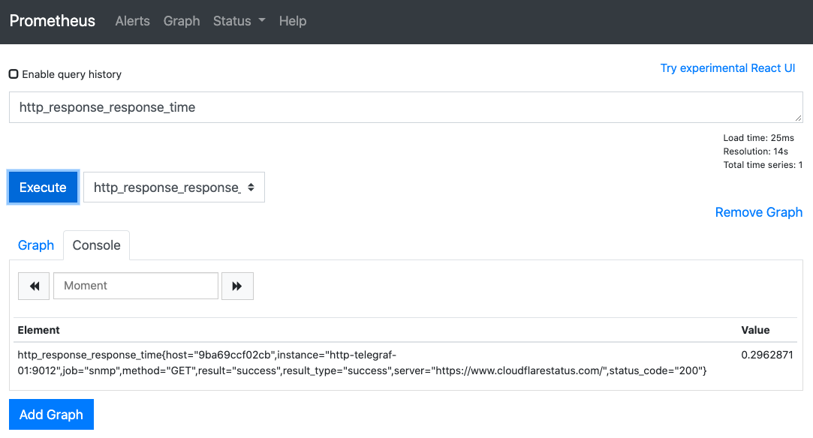
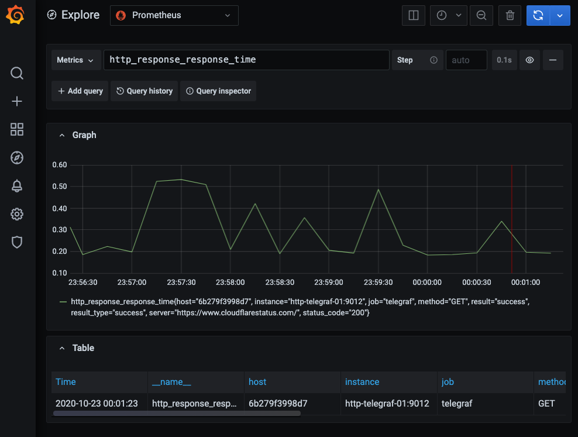
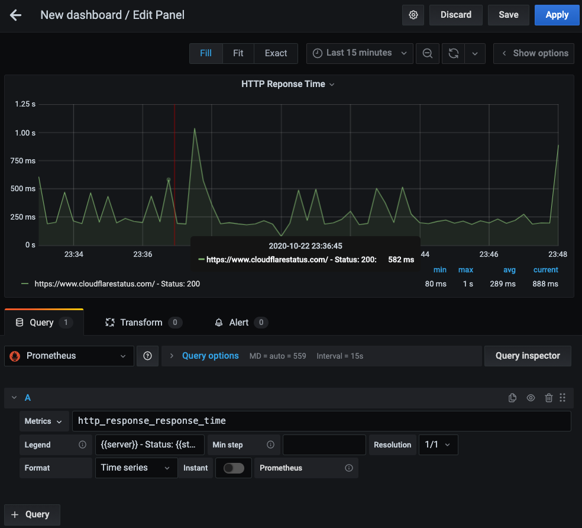
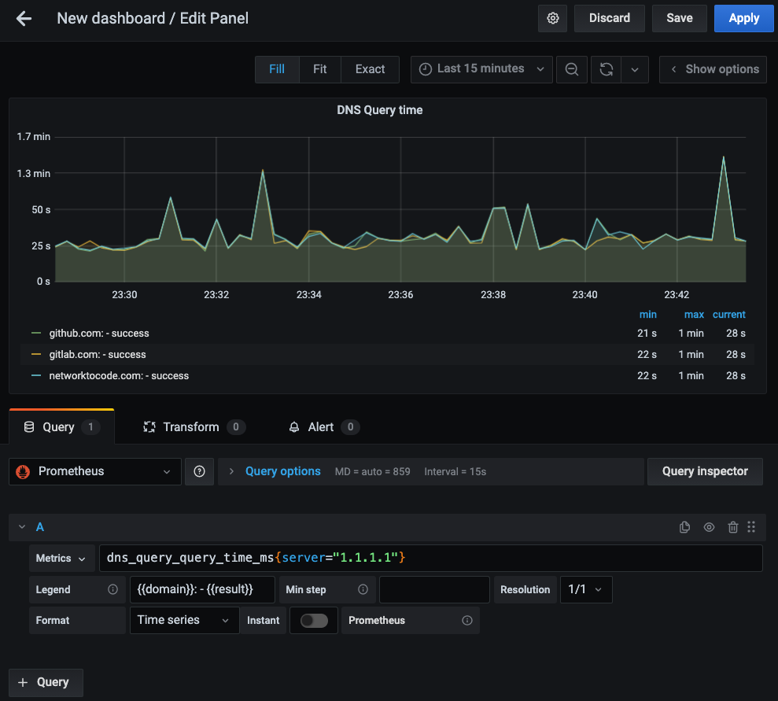

# Challenge Exercise Solution Guide

## Using TPG Monitoring stack

The goal of this exercise is to interact with the different components of a TPG stack (Telegraf, Prometheus, Grafana), from a network monitoring perspective.

## Solution Walkthrough

The configurations completed are present under the `configs/` folder:

- [HTTP Telegraf configuration](configs/http-telegraf-01.conf)
- [DNS Telegraf configuration](configs/dns-telegraf-01.conf)

### Lab turnup

Now, first turn up the lab.

```shell
> docker-compose up -d
Creating network "solution_default" with the default driver
Creating prometheus ... done
Creating grafana    ... done
Creating http-telegraf-01 ... done
Creating dns-telegraf-01  ... done
```

Verify that there are no issues with the telegraf instances, for example:

```shell
❯ docker logs -f http-telegraf-01
2020-10-22T21:49:38Z I! Starting Telegraf 1.15.3
2020-10-22T21:49:38Z I! Using config file: /etc/telegraf/telegraf.conf
2020-10-22T21:49:38Z I! Loaded inputs: http_response
2020-10-22T21:49:38Z I! Loaded aggregators:
2020-10-22T21:49:38Z I! Loaded processors:
2020-10-22T21:49:38Z I! Loaded outputs: prometheus_client
2020-10-22T21:49:38Z I! Tags enabled: host=9ba69ccf02cb
2020-10-22T21:49:38Z I! [agent] Config: Interval:10s, Quiet:false, Hostname:"9ba69ccf02cb", Flush Interval:10s
2020-10-22T21:49:38Z I! [outputs.prometheus_client] Listening on http://[::]:9012/metrics
```

### Metrics verification

Verify that metrics collected are exposed to the **prometheus client**.

```shell
❯ curl -XGET http://localhost:9012/metrics | grep http_response
# HELP http_response_response_time Telegraf collected metric
# TYPE http_response_response_time untyped
http_response_response_time{host="9ba69ccf02cb",method="GET",result="success",result_type="success",server="https://www.cloudflarestatus.com/",status_code="200"} 0.2126921
<Output ommitted>
```

You should be able to see the measurement like `http_response_response_time`. In the example above you can see the metric value (`0.2126921`) to that measurement.

You can also verify the metrics in the Prometheus UI.



### Grafana visualizations

After you login to Grafana (http://localhost:3000), you can go to the **Explore** and verify the metrics. For example:



Here are also example screenshots of the panels visualizations for HTTP and DNS query times:




