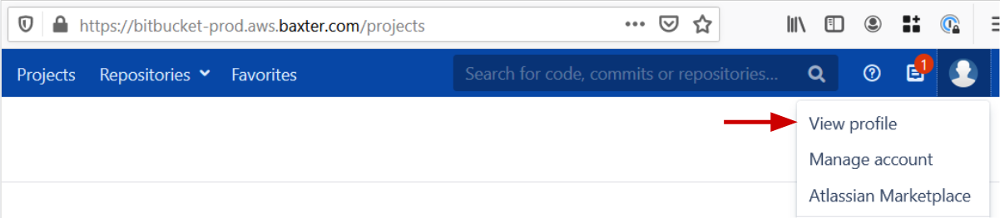
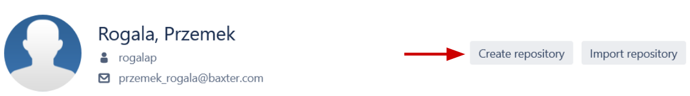
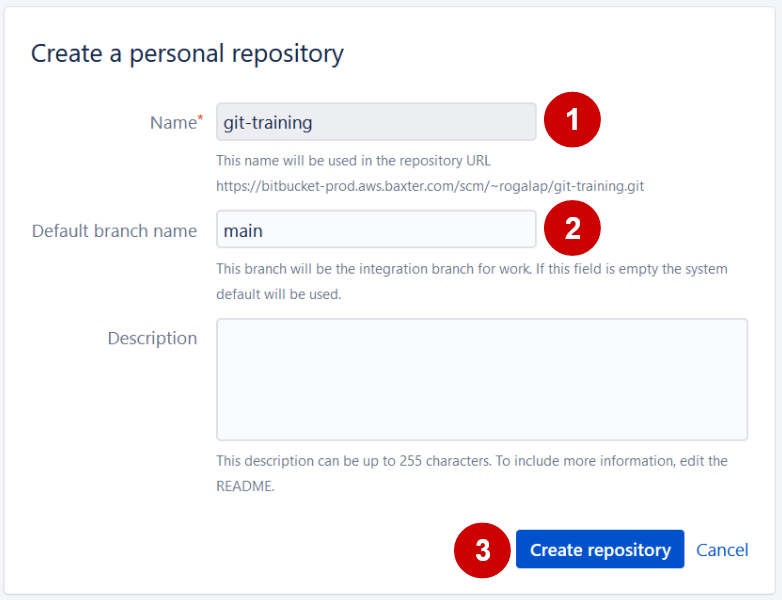

# Challenge - Git Fundamentals

The goal of this exercise is to learn how to work with Git Version Control System. You will practice working with the local and remote Git repositories using Git CLI client and BitBucket.

## Exercise Overview

### Prerequisites

You will need to have Git software installed on your machine.

### Tasks

Submitting your solution for this challenge is optional - feel free to ask for help via email, chat, or at the open office hours if you get stuck!

#### Task 1 - Creating new Git repository

In this task, you will create a new Git repository.

- Create a directory called `git-training`.

- Create a new, empty Git repository inside of the `git-training` directory.

- Your initial branch should be called `main`.

- Check the status of the repository you just created.

Submit Git commands you used and shell output showing the status of the repository.

> Hint: Use command `git branch -m main` to rename the initial branch after you initialized your Git repository.

#### Task 2 - Configure user name and email

In this task, you will configure the user name and email that Git will associate with the commits you make.

- Configure Git user name.

- Configure Git email address.

- Run command showing configured values.

Submit Git commands you used and output showing configured values.

#### Task 3 - Adding a new file and checking repository status

In this task, you will create a new file in the directory where your git repository is located. You will then check the status of the repository.

- Create file called `vlans.cfg` and copy-paste the below lines into it:

    ```
    vlan 30
    name Data

    vlan 40
    name Voice

    vlan 50
    name Office
    ```

- Check the status of the repository. Which area of Git is this file currently located in?

- If you made changes to the file now, would Git be aware of them?

#### Task 4 - Asking Git to track changes to the file

In this task, you will ask Git to start tracking changes made to the `vlans.cfg` file.

You are asked to:

- Use the Git command to add the `vlans.cfg` file to the staging area.

- Check the status of the file. What does Git tell us about this file?

- Add a new VLAN with the VID `60` and name `Printers` to the `vlans.cfg` file.

- Check the status of the file again. What does Git show now?

- What would happen if we committed this file? Would the change we just made be included in the commit snapshot?

- Use the Git command that will ensure the change we just made is included in the next commit.

#### Task 5 - Committing changes

In this task, you are asked to commit the file, and changes made to it. You then will review the commit history.

- In the previous task we created a file and made changes to it. You are now asked to create a point-in-time snapshot of the repository by committing staged changes. You can use any message you want for this commit.

- Once you made your commit, retrieve commit history and copy output for the commit you just made.

- Identify the ID of the commit you just made.

#### Task 6 - Viewing differences between Git areas

In this task, you are asked to modify a file and confirm differences between the last snapshot and the current version of the file.

- Remove config for the VLAN 60 and add the below VLAN config to the bottom of the `vlans.cfg` file:

```
vlan 70
 name Factory
```

- Check the difference between your working directory and the last commit. Copy the output.

- What do `-` and `+` signs mean in the context of Git diffs?

- Make a new snapshot by committing changes you just made. Use commit message `Adding vlan 70.`

- Check commit history. How many commit entries are there now?

#### Task 7 - Working with the remote repository

In this task, you are asked to create a  remote private repository on BitBucket. You will then push your local repository to it.

First, you need to create a remote repository on BitBucket. To do that follow the steps below:

- Log into BitBucket using your AD credentials: [Bitbucket](https://bitbucket-prod.aws.baxter.com).

- Click on your profile icon in the top-right corner and then click on the `View profile` menu item.
  
    
 
- On your profile page click on the `Create repository` button.

    

- On the repository creation form enter `git-training` (1) as the name. Use `main` as the default branch name (2) and click on the `Create repository` button (3).

    

Your remote repository should now be in place. Switch over to your local Git repository and complete the following tasks.

- Configure your local repository to track the repository you just created in BitBucket.

- Confirm your local repository is tracking the BitBucket remote repository. Copy command you used and its output.

- Push contents of your local repository to the remote. Provide a copy of the output you get after the operation is completed.

- After push is completed, navigate to your repository in BitBucket and take a screenshot showing differences between current and previous versions of the `vlans.cfg`.

- Find and take a screenshot of the GUI page showing commit history.

> Hints:
>  - Remember to retrieve the URL of the remote repository from BitBucket GUI.
>  - Remember to set upstream branch tracking.
>  - Use your AD credentials when prompted for username and password.

#### Task 8 - Cloning existing remote repository

In this task, you are asked to make a local copy of a remote repository.

- Switch to a new empty directory.

- Make a local copy of the remote repository you created in task #7.

- Check the status of the local repository. Copy the output.

- Check if the local repository has any remotes configured. Copy the output.

#### Task 9 - Bonus - Creating new branch

In this task, you're asked to create a pull request and merge a new branch into the `main` branch.

- Create a new branch for your repository. Name it `adding-svis`.

- In your new branch create a file named `svis.cfg` and add the below lines to it:

    ```
    interface Vlan30
     description Data_SVI
     ip address 10.90.10.1 255.255.255.0

    interface Vlan50
     description Office_SVI
     ip address 10.90.11.1 255.255.255.0
    ```

- Add the file to staging and make a commit.

- Push the `adding-svis` branch to the remote repository.

- Navigate to the BitBucket GUI and take a screenshot showing the contents of the `svis.cfg` file.

> Hint: You will have to either set the upstream branch for this local branch or explicitly specify the remote branch you're pushing to.

#### Task 10 - Bonus - Pull request and merging branches

In this task, you will merge the `adding-svis` branch into the `main` branch.

- Navigate to your repository in BitBucket.

- Find the `Pull requests` space, navigate to it and create a new pull request. 
  - Your pull request should merge the branch `adding-svis` into the `main` branch.
  - Use `Merging in svi configs` as the title of your pull request.
  - Take a screenshot showing diff for this pull request.

- Merge your pull request. You can keep the default messages and settings.

- Take a screenshot of the commit history for the `main` branch as shown in the BitBucket GUI.

- Navigate back to your local repository, use the `main` branch. Synchronize the local repository with the remote repository.

- Investigate commit history and confirm the merge message is there. Copy the output for the merge commit.

### Reference Enablement Material

- Git fundamentals
 
> Note: Recordings of the relevant sessions can be found online at: https://training.networktocode.com/ 

### External references

- [The Pro Git book](https://git-scm.com/book/en/v2)
- [Git Reference Manual](https://git-scm.com/docs)