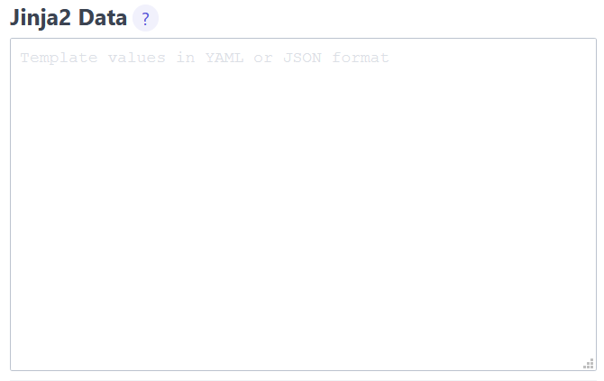
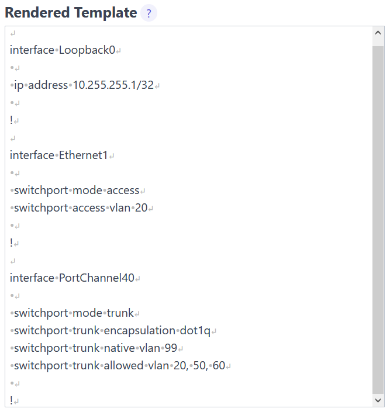
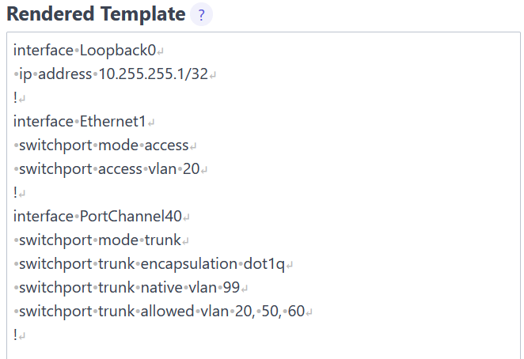
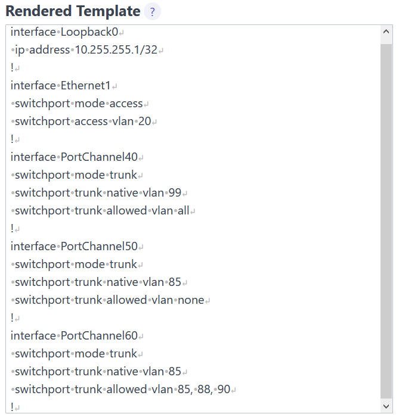
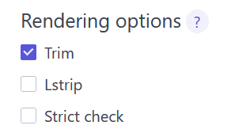
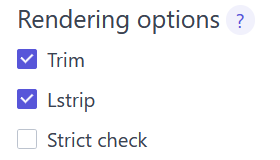

# Lab 03 - Jinja whitespace rendering

Goals of this lab:

- Observe default whitespace rendering behavior.
- Practice the use of manual stripping operators.
- Understand the effect on the rendering of the `trim` option.
- Understand the effect on the rendering of the `lstrip` option.

## Task 01

# Step 1

In this task, you will use [Online Jinja2 renderer](https://j2live.ttl255.com). Navigate to it now.

# Step 2

Paste the below data into the `Jinja2 Data` text area.

```
---
interfaces:
 - name: Loopback0
   type: layer3
   ip: 10.255.255.1/32
 - name: Ethernet1
   type: layer2_access
   access_vlan: 20
 - name: PortChannel40
   type: layer2_trunk
   native_vlan: 99
   allowed_vlans: "20, 50, 60"
```



Paste the below template into the `Jinja2 Template` text area.

```

interface {{ intf['name'] }}
 
 ip address {{ intf['ip'] }}
 
 switchport mode access
 switchport access vlan 20
 
 switchport mode trunk
 switchport trunk encapsulation dot1q
 switchport trunk native vlan {{ intf['native_vlan'] }}
 switchport trunk allowed vlan {{ intf['allowed_vlans'] }}
 
!

```

Render the template. Notice many extra whitespaces added to the output.

Switch `Show whitespaces` toggle to on to make all of the whitespaces visible.


You should see not only extra new lines but also additional spaces inserted on some lines.



# Step 3

You will now use indentation within expression blocks and manual whitespace control to improve this output.

After you're finished Your output should match the below one, with `Show whitespaces` toggle enabled.



<details>
  <summary>Reveal Answer</summary>

Move indentation preceding `` expressions to the inside of the delimiter.

Add `-` manual stripping operators at the end of `` delimiter and in front of ``, ``, `` delimiters.

Operator `-` placed at the end of the delimiter will strip all whitespaces following the delimiter.

Operator `-` placed at the start of the delimiter will strip all whitespaces preceding the delimiter.

```

interface {{ intf['name'] }}

 ip address {{ intf['ip'] }}

 switchport mode access
 switchport access vlan 20

 switchport mode trunk
 switchport trunk encapsulation dot1q
 switchport trunk native vlan {{ intf['native_vlan'] }}
 switchport trunk allowed vlan {{ intf['allowed_vlans'] }}

!

```

</details>


## Task 2

### Step 1

In this task you will use [Online Jinja2 renderer](https://j2live.ttl255.com). Navigate to it now.

### Step 2

Paste the below data into the `Jinja2 Data` text area.

```
---
interfaces:
 - name: Loopback0
   type: layer3
   ip: 10.255.255.1/32
 - name: Ethernet1
   type: layer2_access
   access_vlan: 20
 - name: PortChannel40
   type: layer2_trunk
   native_vlan: 99
   allowed_vlans: "all"
 - name: PortChannel50
   type: layer2_trunk
   native_vlan: 85
   allowed_vlans: "none"
 - name: PortChannel60
   type: layer2_trunk
   native_vlan: 85
   allowed_vlans: "85, 88, 90"
```

Paste the below template into the `Jinja2 Template` text area.

```

interface {{ intf['name'] }}
 
 ip address {{ intf['ip'] }}
 
 switchport mode access
 switchport access vlan 20
 
 switchport mode trunk
  
 switchport trunk native vlan {{ intf['native_vlan'] }}
  
  
 switchport trunk allowed vlan none
  
 switchport trunk allowed vlan all
  
 switchport trunk allowed vlan {{ intf['allowed_vlans'] }}
  
 
!

```

Render the template. Notice many extra whitespaces added to the output.

Click on `Show whitespaces` toggle to make all of the whitespaces visible.

# Step 3

You will now use indentation within expression blocks and manual whitespace control to improve this output.

Your output should match the below one, with `Show whitespaces` toggle enabled.



<details>
  <summary>Reveal Answer</summary>

Move indentation preceding `` expressions to the inside of the delimiter.

Add `-` manual stripping operators at the end of `` delimiter and in front of ``, ``, `` delimiters.

Operator `-` placed at the end of the delimiter will strip all whitespaces following the delimiter.

Operator `-` placed at the start of the delimiter will strip all whitespaces preceding the delimiter.

```

interface {{ intf['name'] }}

 ip address {{ intf['ip'] }}

 switchport mode access
 switchport access vlan 20

 switchport mode trunk

 switchport trunk native vlan {{ intf['native_vlan'] }}


 switchport trunk allowed vlan none

 switchport trunk allowed vlan all

 switchport trunk allowed vlan {{ intf['allowed_vlans'] }}


!

```

</details>


## Task 3

### Step 1

In this task you will use [Online Jinja2 renderer](https://j2live.ttl255.com). Navigate to it now.

### Step 2

Paste the below data into the `Jinja2 Data` text area.

```
---
interfaces:
 - name: Loopback0
   type: layer3
   ip: 10.255.255.1/32
 - name: Ethernet1
   type: layer2_access
   access_vlan: 20
 - name: PortChannel40
   type: layer2_trunk
   native_vlan: 99
   allowed_vlans: "all"
 - name: PortChannel50
   type: layer2_trunk
   native_vlan: 85
   allowed_vlans: "none"
 - name: PortChannel60
   type: layer2_trunk
   native_vlan: 85
   allowed_vlans: "85, 88, 90"
```

Paste the below template into the `Jinja2 Template` text area.

```

interface {{ intf['name'] }}
 
 ip address {{ intf['ip'] }}
 
 switchport mode access
 switchport access vlan 20
 
 switchport mode trunk
  
 switchport trunk native vlan {{ intf['native_vlan'] }}
  
  
 switchport trunk allowed vlan none
  
 switchport trunk allowed vlan all
  
 switchport trunk allowed vlan {{ intf['allowed_vlans'] }}
  
 
!

```
### Step 3

Render the template and take a screenshot of the output with whitespaces visible.

### Step 4

Now enable the `Trim` option in the `Rendering options` section and render the template. 



Observe what happened to the new lines and spaces. Use a screenshot from the previous task to compare the differences.
### Step 5

Next, enable the `Lstrip` option in the `Rendering options` section and render the template.



Does the output look better now? Make whitespaces visible and see what changed compared to the `Trim` only option.

Take the screenshot of the output. We'll use it for comparison in the next step.

### Step 6

Uncheck the `Lstrip` option but leave the `Trim` option checked.

Move indentation from outside of Jinja `` delimiters to the inside of block tags.

Render the template, make whitespaces visible and compare the output to the output from task 5. Can you see any differences?
