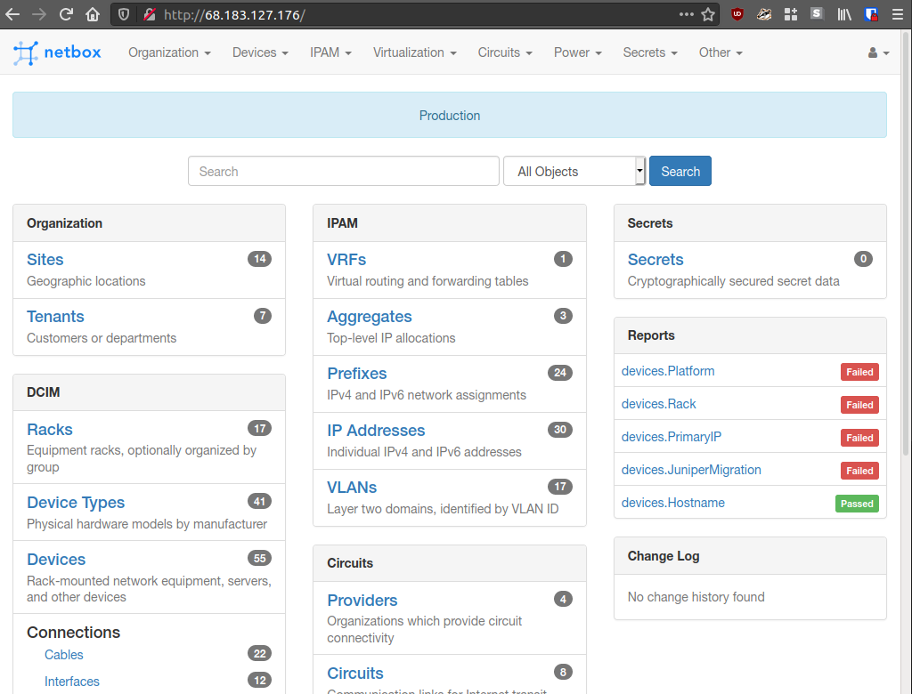
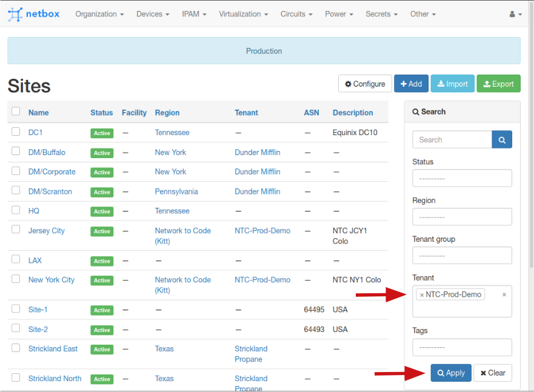
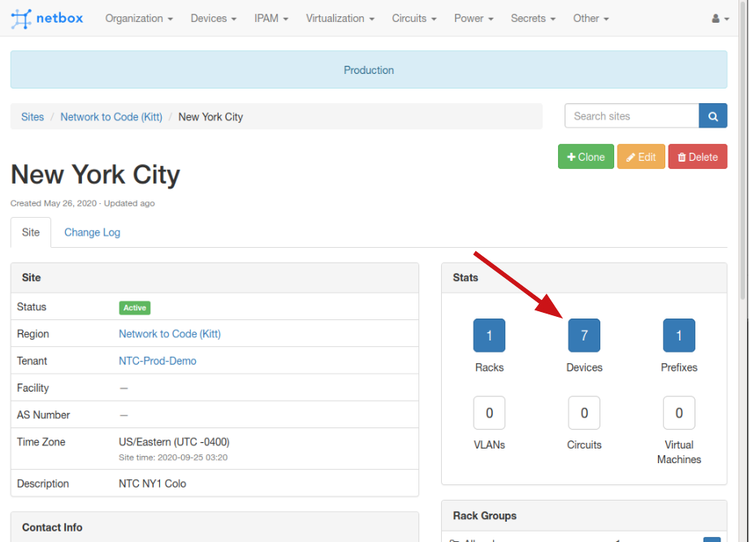
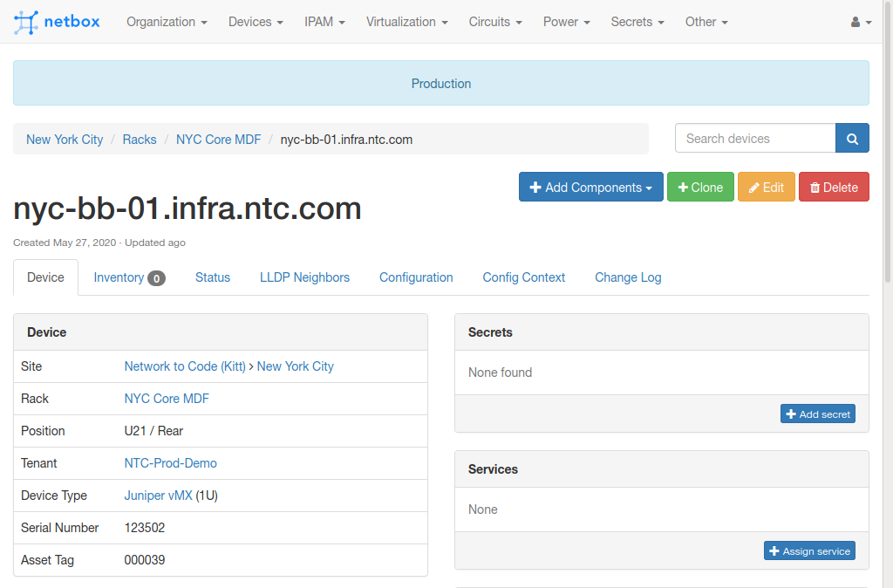
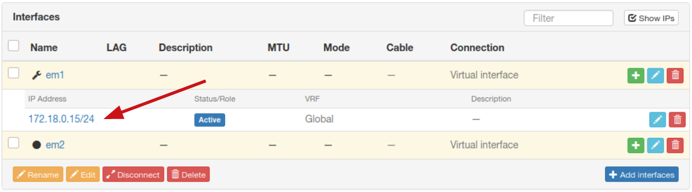
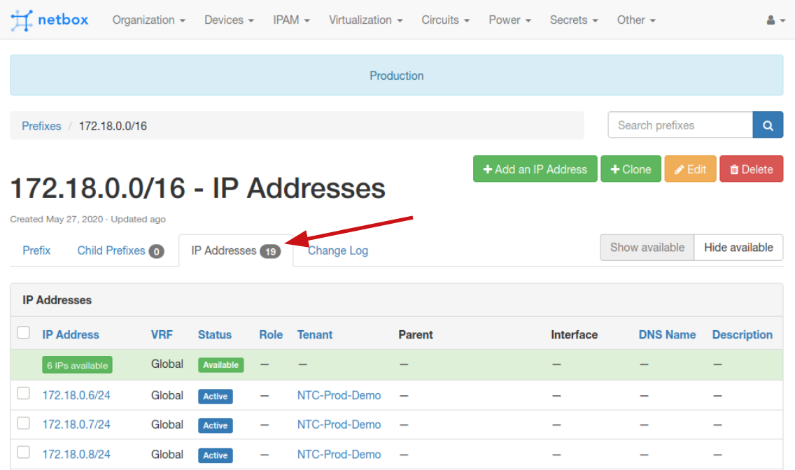

# NTC Netbox Workshop - Lab 01

This is an exploration lab - you will be navigating through the provided Netbox instance and getting familiar with the data populated within.

> You will receive the IP address of your own Netbox instance together with the credentials from the instructor during the workshop.

## Task 1

This task explores step by step some of the data pre-populated in Netbox.

### Step 1

Open the Netbox web interface at the IP provided and log in.

### Step 2

Open the list of `Sites` - you will find the link in the top menu under the `Organization` tab.

### Step 3

Look at the table of unfiltered results and the search panel on the right. Select from the `Tenant` filter the value `NTC-Prod-Demo` and click `Apply`.

### Step 4

Open the `New York City` Site by clicking its name. Look at the various fields for the `Site` object.

### Step 5

Under the `Stats` tab, click on the blue button labelled `Devices`.

### Step 6

Observe the URL in your browser bar - `http://NETBOX_IP/dcim/devices/?site=nyc` - it includes a search parameter for the site you were in. The same parameter is also reflected in the `Search` panel on the right.

### Step 7

Filter the list further by restricting the search only to Juniper devices (Hint: `Manufacturer`). You should see three results.

### Step 8

Open the `nyc-bb-01.infra.ntc.com` Device by clicking on its entry in the search results table. Look at the various fields of the `Device` object.

### Step 9

Scroll down to the Interfaces table and click on `172.18.0.15/24` to open the IP object.

### Step 10

Observe the URL in your browser bar - `http://NETBOX_IP/ipam/ip-addresses/55/`. Notice the red table reporting this IP address has a duplicate.

### Step 11

Identify the Parent Prefix and open its page (`172.18.0.0/16`) by clicking the name in the table.

### Step 12

Click the `IP Addresses` tab and observe the URL `http://NETBOX_IP/ipam/prefixes/18/ip-addresses/`

### Step 13

On closer inspection, you will notice that the `172.18.0.15/24` IP is defined twice. You may delete the occurence that is NOT assigned to a device's interface.

> Hint: Click the entry in the table to open the IP address object, then select the `Delete` red button top right.

## Task 2

Using similar workflow logic as in `Task 1`, try to perform the following operations on your own:

- Find the `Power Feeds` assigned to Rack `HQ-IDF01-R01`
- Find the `Devices` that have the role `leaf` and site `DC1`
- Open `Cables` under the `Devices` menu. Add to the table the `Color` column
    + Hint: Use the `Configure` button, Ctrl-click to select an additional column - ensure you still have all the previous columns visible!
    + Filter the `Cables` that have only the `Black` color.
