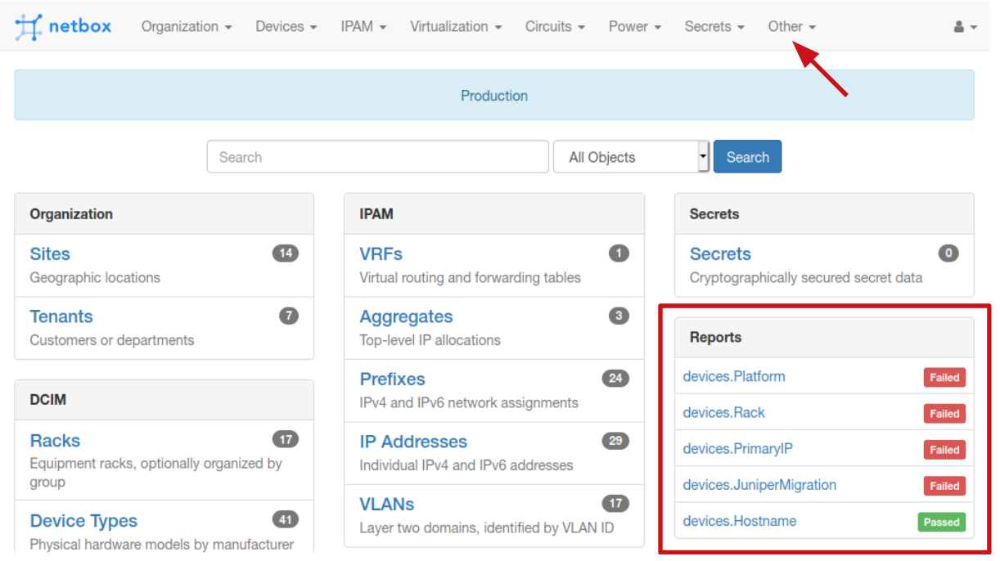
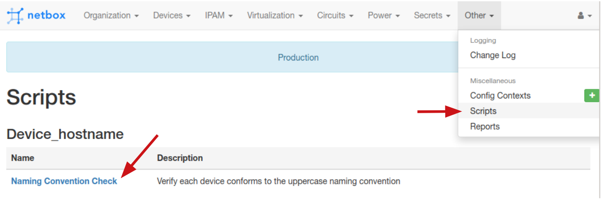
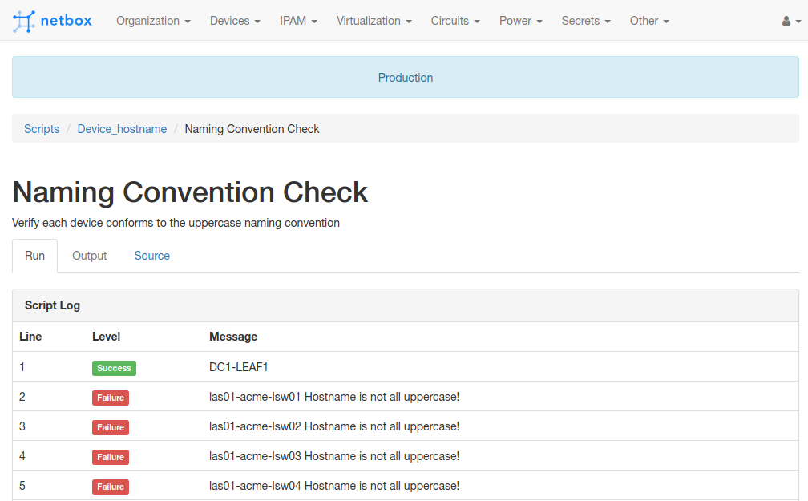

# NTC Netbox Workshop - Lab 02

In this lab you will be interacting with the `Reports` and `Custom Scripts` that have been already provisioned in your Netbox.

> You will receive the IP address of your own Netbox instance together with the credentials from the instructor during the workshop.

## Task 1

This task explores Netbox's Reports feature.

### Step 1

Open the Netbox web interface at the IP provided and log in.

### Step 2

Observe the `Reports` summary panel in the homepage of Netbox, giving you the Pass/Fail status of the latest run of each Report.

### Step 3

Open the `Reports` section from the top bar menu `Other`. Notice the slightly more detailed view of each report, its individual runs and four result types (success/green, info/blue, warning/amber, failure/red).

### Step 4

Click the `Hostname` report link in the table to open the detailed view of this report. Observe the URL in your browser bar - `http://NETBOX_IP/extras/reports/devices.Hostname/`.

> The report is defined in a file called `devices.py` and the code resides in a class called `Hostname`. It performs a simple check, that the hostname is using only UPPERCASE letters.

### Step 5

Take note of the results summary (13 devices succeeded the test) and the last run date of the report - not very recent!

Click the `Run Report` blue button.

### Step 6

Explore the newly refreshed results. The date will have updated, the report is now overall `Failed` because of the 42 devices that are not compliant. Scroll down in the page and explore the results.

### Step 7

Go back to the main `Reports` page and open the `JuniperMigration` report. Re-run it and explore the results - notice that if the compliance check cannot be performed (data is missing), then the report code marks that result with a different label.

> The device.JuniperMigration report tests whether the `platform` attribute of a device starts with the letters "ju".

### Step 8

Take some time to explore the other Reports (`Platform`, `PrimaryIP` and `Rack`). They all do very similar checks which should be easy to understand from the name of the report function (e.g. `test_device_has_primary_ip`) even without seeing the Python code.

## Task 2

This task explores Netbox's Custom Scripts feature.

### Step 1

From the top menu, head over to `Other` and select `Scripts`.

### Step 2

Custom Scripts are very similar to Reports, but they have the added functionality of being able to accept user input via the Netbox UI.

Select the only script available to you from the table: `Naming Convention Check`.

### Step 3

This script performs the same test as the report used in the previous task - a device is compliant if its name is all UPPERCASE. The twist is that you can run it only for devices that belong to a particular site.

Select the `HQ` site from drop-down list and click `Run Script`.

> Bonus: The scripts UI allows you to inspect the Python code by selecting the `Source` tab.

> You may ignore the `Commit changes` option since this script is read-only.

### Step 4

Explore the results and scroll down to the bottom of the page if you want to re-run the script on a different site (e.g. `DC1` will also have non-compliant devices).

