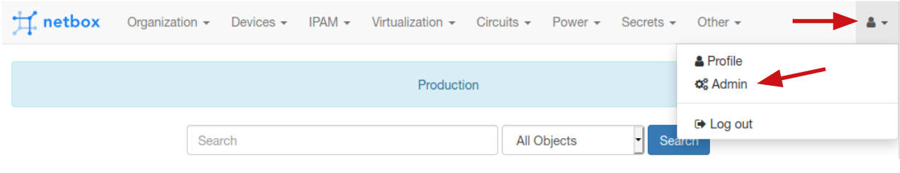
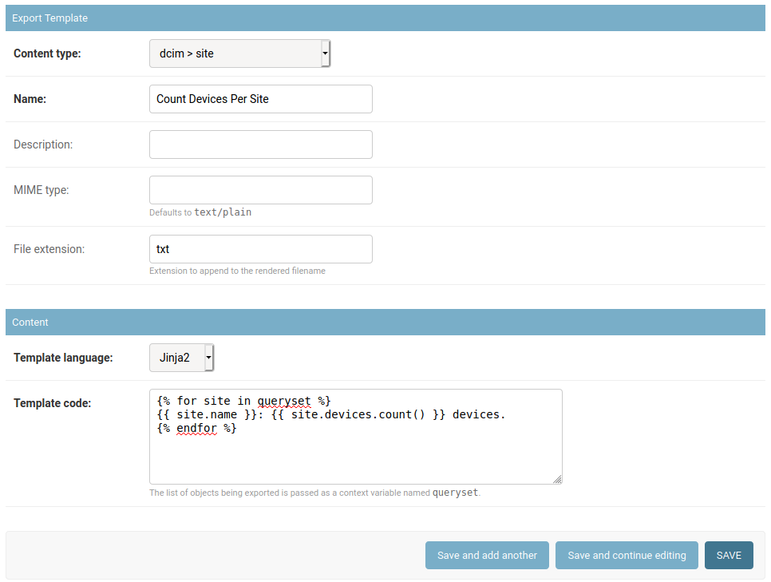
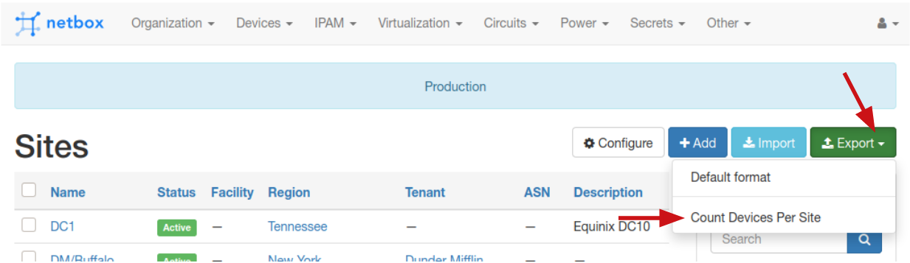

# NTC Netbox Workshop - Lab 03

In this lab you will be creating your own custom Export Templates in Netbox.

> You will receive the IP address of your own Netbox instance together with the credentials from the instructor during the workshop.

## Task 1

This task creates an exportable text report that counts the number of devices per site.

### Step 1

Open the Netbox web interface at the IP provided and log in.

### Step 2

To create a new Export Template, you need to head over to the Netbox Admin panel. Open it now from the top-right user menu.



### Step 3

Click on the `Export Templates` link under the `Extras` category. This is where you will see a list of your defined templates once you've created some.

### Step 4

Click on the `ADD EXPORT TEMPLATE` button on the right-hand side of the page.

### Step 5

Fill in the form as follows:

- From the `Content type` drop-down, select `dcim > site`.
- In the `Name` field input `Count Devices Per Site`.
- Optionally, add a description if you wish.
- Set the `File extension` field to `txt`
- Leave the `Template language` to `Jinja2`

> You're leaving the MIME type field to its default since the output will be plain text.

### Step 6

In the `Template code` field add the following:

```

{{ site.name }}: {{ site.devices.count() }} devices.

```

### Step 7

Double check that everything looks like the screenshot below and click the `SAVE` button at the bottom of the page.



### Step 8

Open your main Netbox page in a separate browser tab and navigate to the `Sites` page (hint: it's under the `Organization` top menu).

### Step 9

Notice that the `Export` button has now turned into a drop-down. Click it and select the new addition, your export template `Count Devices Per Site`.



### Step 10

Netbox will offer you a file to download which is your custom export result. Save it on your disk and open it in a text editor - it will have the following contents.

```

DC1: 29 devices.

DM/Buffalo: 0 devices.

DM/Corporate: 0 devices.

DM/Scranton: 0 devices.

HQ: 12 devices.

Jersey City: 5 devices.

LAX: 2 devices.

New York City: 7 devices.

Site-1: 0 devices.

Site-2: 0 devices.

Strickland East: 0 devices.

Strickland North: 0 devices.

Strickland South: 0 devices.

Strickland West: 0 devices.
```

### Step 11

The information in the export is great, but it has a bit too much whitespace in it. Let's fix that.

Head back to the Admin panel browser tab (or open a new one) and click the export template `Count Devices Per Site` to edit it.

Update the `Template code` with the following (there's a `-` added to the closing bracket of the for loop telling Jinja2 to trim the newline there):

```

{{ site.name }}: {{ site.devices.count() }} devices.

```

### Step 12

Back in the main Netbox Sites page, export again and compare the result:

```
DC1: 29 devices.
DM/Buffalo: 0 devices.
DM/Corporate: 0 devices.
DM/Scranton: 0 devices.
HQ: 12 devices.
Jersey City: 5 devices.
LAX: 2 devices.
New York City: 7 devices.
Site-1: 0 devices.
Site-2: 0 devices.
Strickland East: 0 devices.
Strickland North: 0 devices.
Strickland South: 0 devices.
Strickland West: 0 devices.
```


## Task 2

This task creates an exportable custom csv with IP prefix data.

### Step 1

In the Netbox Admin panel, create a new Export template as follows:

Fill in the form as follows:

- From the `Content type` drop-down, select `ipam > prefix`.
- In the `Name` field input `Custom Prefix CSV`.
- In the `Description` field input `Includes Site, Created Date, Role and Size.`
- Set the `File extension` field to `csv`
- Leave the `Template language` to `Jinja2`

### Step 2

In the `Template code` field add the following:

```
prefix,site,allocated,role,size

  {{ p.prefix }},
  {{- p.site }},
  {{- p.created.isoformat() }},
  {{- p.role }},
  {{- p.prefix.size }}

```

> Take note of the CSV header that is simply text and then a loop over all prefixes, pulling custom data. While the template is multiline, the csv output should be one line per prefix - therefore we're using Jinja2 whitespace management to remove all the extra newlines from the output.

### Step 3

Head over to the `IPAM->Prefixes` page in the main Netbox interface browser tab. Perform a search to display only prefixes that belong to Site `HQ`.

> The export function always takes the results from the table displayed in front of you with whatever filters are active at the time.

### Step 4

Now export using your custom template `Custom Prefix CSV`. The file should be called `netbox_prefixes.csv` and have the following content:

```
prefix,site,allocated,role,size
10.40.0.0/24,HQ,2020-01-16,Enterprise Access,256
10.63.10.0/24,HQ,2020-01-16,Enterprise Access,256
10.63.20.0/24,HQ,2020-01-16,Enterprise Access,256
10.63.30.0/24,HQ,2020-01-16,Enterprise Access,256
```

> If you have more than 4 prefixes, check back that you have filtered to show only the prefixes belonging to Site `HQ` before exporting.


## Task 3

Optional Challenge!

Your colleague doesn't like CSV too much and asked you to export the same data from the `Task 2` `Custom Prefix CSV` template in a YAML format. Remember, YAML is still just text (conforming to a different syntax), so you will have to reshuffle the existing information around in the Jinja2 template.

Starting from the template in `Task 2`, create a new export template named `Custom Prefix YAML`, so the resulting export looks like the following:

```

- prefix: 10.40.0.0/24
  site: HQ
  created: 2020-01-16
  role: Enterprise Access
  size: 256

- prefix: 10.63.10.0/24
  site: HQ
  created: 2020-01-16
  role: Enterprise Access
  size: 256

- prefix: 10.63.20.0/24
  site: HQ
  created: 2020-01-16
  role: Enterprise Access
  size: 256

- prefix: 10.63.30.0/24
  site: HQ
  created: 2020-01-16
  role: Enterprise Access
  size: 256
```


### SOLUTION BELOW - SCROLL ONCE YOU'RE DONE TO COMPARE


```


```

This is how the Jinja2 template code should look like:

```
# Custom Prefix YAML
# Includes Site, Created Date, Role and Size.
# yml

- prefix: {{ p.prefix }}
  site: {{ p.site }}
  created: {{ p.created.isoformat() }}
  role: {{ p.role }}
  size: {{ p.prefix.size }}

```
