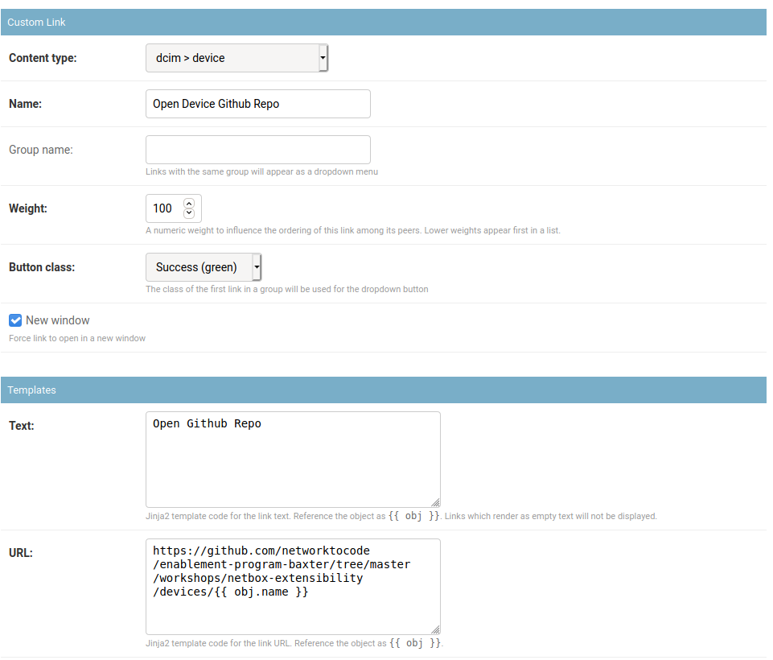
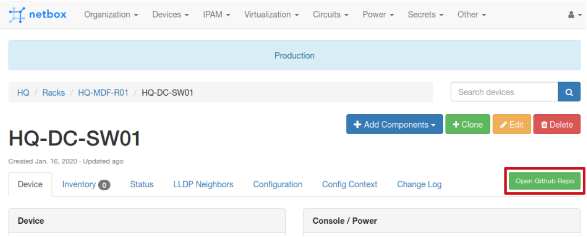
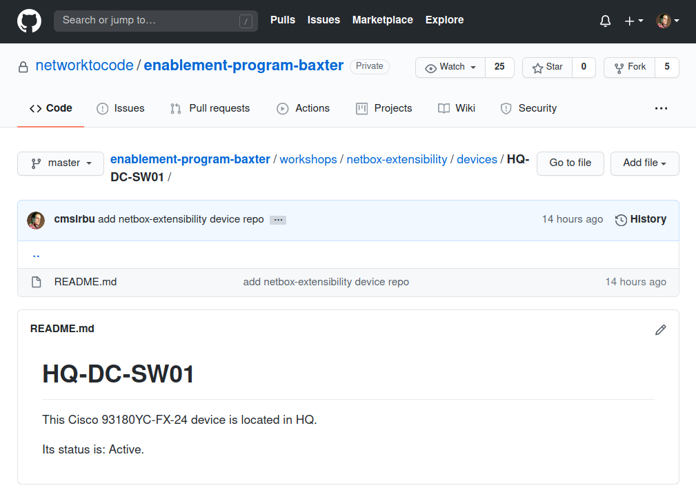

# NTC Netbox Workshop - Lab 04

In this lab you will be creating your own Custom Links in Netbox.

> You will receive the IP address of your own Netbox instance together with the credentials from the instructor during the workshop.

## Task 1

This task creates a new button (Custom Link) in the Device page to open an external Github repository with data about that Device.

### Step 1

Open the Netbox web interface at the IP provided and log in.

### Step 2

In the same browser, ensure you are logged in to your Github account and confirm you can open the following repository: [https://github.com/networktocode/enablement-program-baxter](https://github.com/networktocode/enablement-program-baxter)

### Step 3

In the `workshops/netbox-extensibility/devices` subfolder of the [repository](https://github.com/networktocode/enablement-program-baxter/tree/master/workshops/netbox-extensibility/devices) you will notice a folder structure similar to the one below.

```
workshops/netbox-extensibility/devices/
├── DC1-LEAF1
│   └── README.md
├── HQ-CORE-SW01
│   └── README.md
├── HQ-CORE-SW02
│   └── README.md
├── HQ-DC-SW01
│   └── README.md
├── HQ-DC-SW02
│   └── README.md
├── HQ-IDF01-PDU01
│   └── README.md
├── HQ-IDF01-PDU02
│   └── README.md
... OUTPUT TRIMMED
```

### Step 4

Back in Netbox, to create a new Custom Link, you need to head over to the Netbox Admin panel. Open it now from the top-right user menu.

Click on `Custom Links` under the `Extras` category. This is where you will see a list of your defined links once you've created some.

### Step 5

Add a new Custom Link with the following parameters:

- Content type: `dcim > device`
- Name: `Open Device Github Repo`
- Button class: `Success (green)`
- Tick the `New window` checkbox
- Link text: `Open Github Repo`
- URL: `https://github.com/networktocode/enablement-program-baxter/tree/master/workshops/netbox-extensibility/devices/{{ obj.name }}`

### Step 6

Your custom link form should look like the following:



### Step 7

In the main Netbox interface, navigate to devices and select one at random. Take note of the brand new green button that is now rendered!



### Step 8

Push the button! A new browser tab should open with the corresponding Github subfolder for that device.



### Step 9

Feel free to play around with other devices and inspect the generated links.
