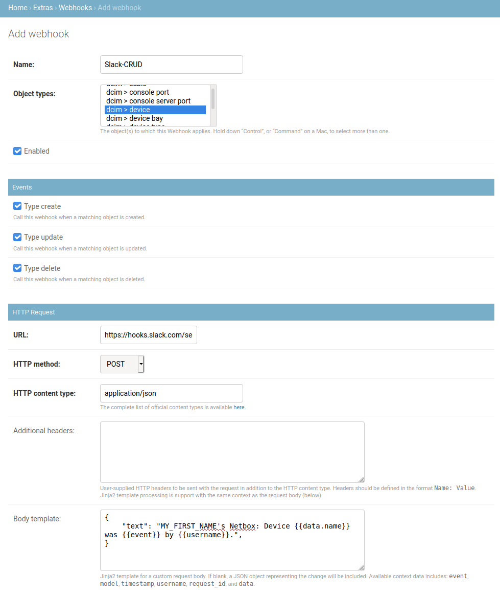
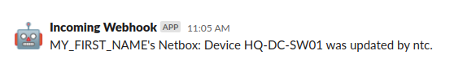
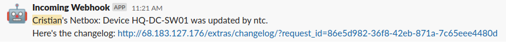
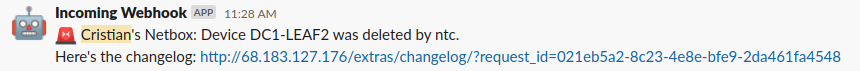

# NTC Netbox Workshop - Lab 05

In this lab you will be creating Webhooks in Netbox to send notifications to a Slack channel when Create/Update/Delete (CRUD) operations are performed in Netbox.

> You will receive the IP address of your own Netbox instance together with the credentials from the instructor during the workshop.

> The webhook URL for the lab will also be provided during the session.

## Task 1

This task creates a new webhook for the Device objects, so that a very simple message is sent to a Slack channel when any CRUD operations are performed.

### Step 1

Open the Netbox web interface at the IP provided and log in.

### Step 2

In Netbox, to create a new Webhook, you need to head over to the Netbox Admin panel. Open it now from the top-right user menu.

Click on `Webhooks` under the `Extras` category. This is where you will see a list of your defined webhooks once you've created some.

### Step 3

Add a new Webhook with the following parameters:

- Name: `Slack-CRUD`
- Object types: `dcim > device`
- Enabled: checked.
- Events: select all three types (Create, Update, Delete)
- URL: ASK YOUR INSTRUCTOR!!!
- HTTP method: POST
- HTTP content type: application/json
- Leave SSL verification as it is.

The Body template should be the following JSON text - replace MY_FIRST_NAME with your name!!!

```json
{
    "text": "MY_FIRST_NAME's Netbox: Device {{data.name}} was {{event}} by {{username}}.",
}
```

### Step 5

Your webhook form should look like the following:



### Step 6

In the main Netbox interface, navigate to a device and `Edit` it. Make a change to a field like `Serial Number` and save it.

### Step 7

Your instructor will be sharing their Slack window and you should be able to see a new message pop up:

```
Incoming Webhook APP  11:05 AM
MY_FIRST_NAME's Netbox: Device HQ-DC-SW01 was updated by ntc.
```



Feel free to Create (or Clone), Update and Delete devices to see how this looks!

> Make sure you replaced MY_FIRST_NAME with your actual name in the webhook body so you can easily identify your messages in the Slack channel.


## Task 2

This task updates the `Slack-CRUD` webhook to include more information such as a filtered link to the changelog.

### Step 1

Update the `Slack-CRUD` webhook `Body template` with the following - replace MY_FIRST_NAME with your name again and MY_NETBOX_IP with your Netbox IP!!!:

```json
{
    "text": ":rotating_light: MY_FIRST_NAME's Netbox: Device {{data.name}} was {{event}} by {{username}}.\nHere's the changelog: http://MY_NETBOX_IP/extras/changelog/?request_id={{request_id}}",
}
```

Let's disect it (the JSON text has to be a one-liner which makes it a bit harder to read) - remember we are using Jinja2 to make some decisions and plug in dynamic data!

Since it's 2020, it's mandatory to include an emoji with the message - so you will add a red siren light emoji when the event is a deletion.

```
:rotating_light:
```

The simple message from earlier. Have you replaced `MY_FIRST_NAME` with your name?

```
MY_FIRST_NAME's Netbox: Device {{data.name}} was {{event}} by {{username}}.
```

And finally, the coolest part - a dynamic link to the Changelog that shows exactly what happened! Remember to replace `MY_NETBOX_IP` with your actual Netbox IP or the link won't work!

```
\nHere's the changelog: http://MY_NETBOX_IP/extras/changelog/?request_id={{request_id}}
```
It starts with a `\n` since we want the link to be displayed on a separate line.

### Step 2

Test your new and improved webhook! Make another edit to a device.



### Step 3

If your message contains your name and a valid Netbox link, your instructor will paste it back into the Zoom chat for you.

If not, check back with `Step 1` to ensure everything is in place.

### Step 4

Delete a device that you have created. A suitably urgent message should appear in Slack.


