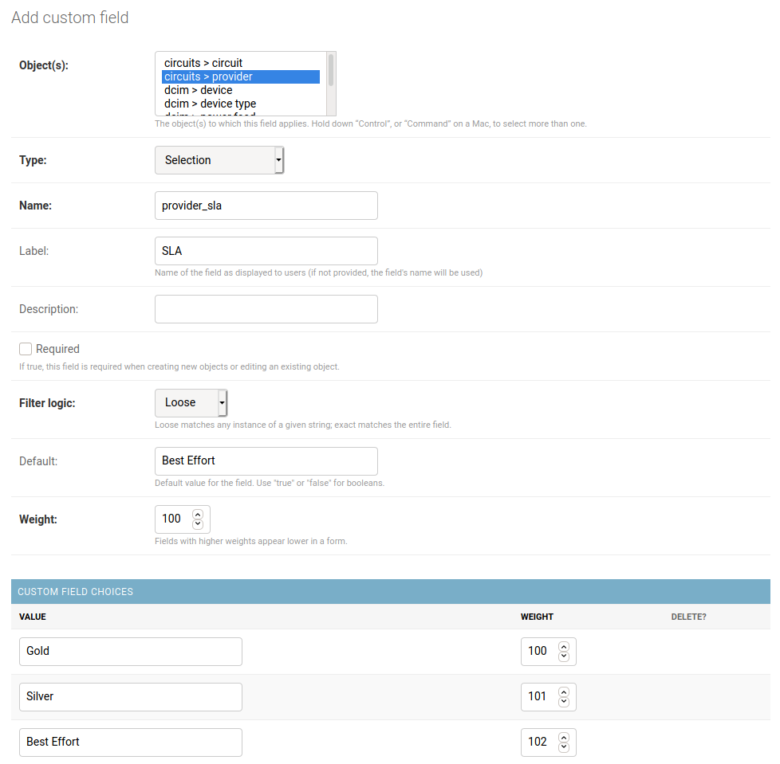
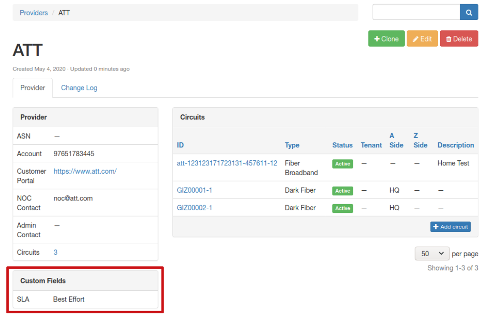
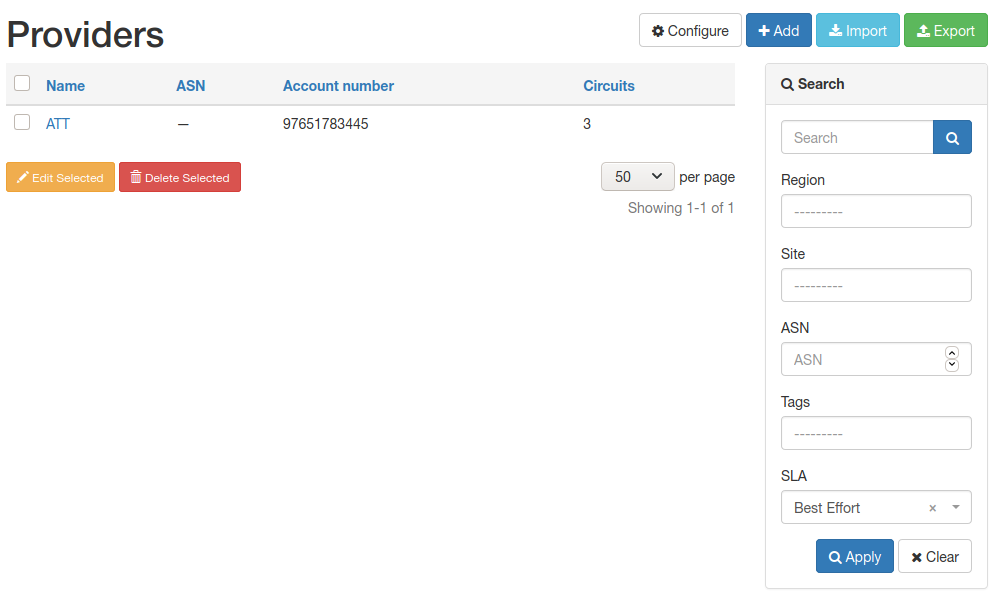

# NTC Netbox Workshop - Lab 06

In this lab you will be exploring the usage of Custom Fields to extend the data models in Netbox.

> You will receive the IP address of your own Netbox instance together with the credentials from the instructor during the workshop.

## Task 1

This task creates a new Custom Field for the Circuit/Providers object.

### Step 1

Open the Netbox web interface at the IP provided and log in.

### Step 2

In Netbox, to create a new Custom Field, you need to head over to the Netbox Admin panel. Open it now from the top-right user menu.

Click on `Custom fields` under the `Extras` category. This is where you will see a list of your defined custom fields. Note there are some already pre-populated there.

### Step 3

Add a new `Custom field` with the following parameters:

- Object(s): `circuits > provider`
- Type: Selection
- Name: provider_sla
- Label: SLA
- Default: Best Effort
- Custom Field Choices: Gold, Silver, Best Effort

### Step 4

Once saved, head over to the Netbox main interface and navigate to the `Circuits -> Providers` section.

### Step 5

Select the `ATT` provider and edit it, adding a `Best Effort` SLA to the new custom field.

### Step 6

Navigate back to the main `Circuits -> Providers` page and filter the table for SLA values of `Best Effort` in the Search panel.

## Task 2

As an optional exploration task, head over to the Admin panel and open the list of all Custom fields. Explore the other defined fields, by identifying which objects they are defined for and searching for the information in the main Netbox interface.
